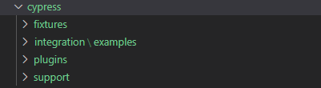
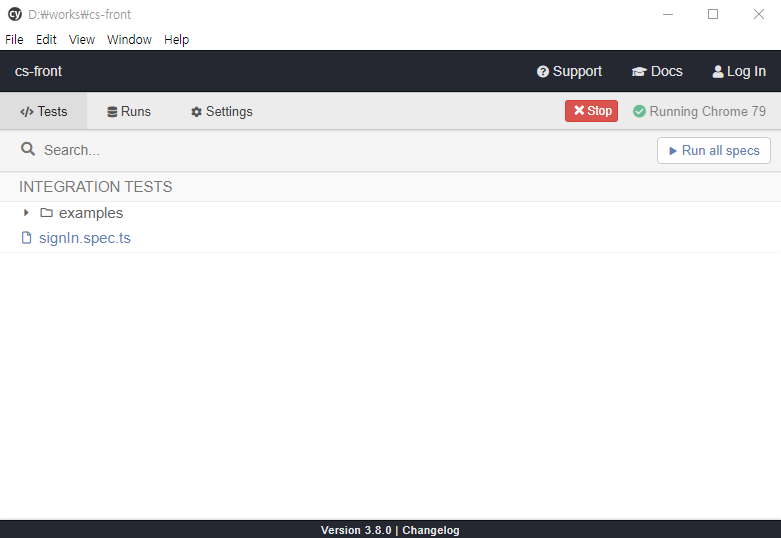

Cypress는 mocha/chai를 기반으로 하는 프론트엔드 테스트 도구이다.
연동된 모든 모듈이나 서비스를 import 해야하는 jasmine/karma와는 달리 import 할 필요없이 사용가능하고 설치하거나 테스트 하는 방법도 간단하다.

## 설치하기 

Cypress는 `npm` 명령어로 간단하게 설치 할 수 있다.

```
npm i cypress
```

## 설정하기 

설치가 끝났다면 바로 `npx cypress open` 으로 시작 할 수 있지만 직접 시작 명령어를 설정하는 것을 추천한다.
`cypress open`은 새로운 크롬 창을 띄워서 화면 테스트를 실행하고 `cypress run`은 터미널에서 간의  테스트를 실행한다. 

* package.json
```
"scripts": {
    "cy:open": "cypress open",
    "cy:run": "cypress run"
}
```

## 시작하기

Cypress는 외부에서 가상으로 검증 하는 것이 아니라 로컬 서버에서 직접 테스트하는 테스트 도구이기 때문에 서버를 먼저 시작한 후 Cypress를 실행해야한다.

```
npm run start
```
로컬 서버를 실행 시켰다면 Cypress를 시작 해보자
```
npm run cy:open
```

처음 Cypress를 실행하면 "cypress"라는 최상위 폴더와 그 안의 하위 폴더들이 생성된다.
또 "cypress/integration"안의 "examples" 폴더가 생성되는데 초보자를 위한 테스트 코드 예제파일들이다.



### 테스트 러너
테스트 러너를 자세히 살펴보자.
오른쪽 상단의 "Run all specs" 버튼이 있다. 이 버튼으로 모든 테스트코드 파일을 검증 할 수도 있고 하나의 파일을 클릭하면 단일 파일의 테스트 코드만 검증 할 수도 있다. 
테스트 러너에서 보이는 파일은 "cypress/integration"안의 저장된 파일들이다.
"cypress/integration" 폴더 안에 `signIn.spec.ts`라는 테스트 코드 파일을 생성해보면 테스트 러너에 방금 생성한 `signIn.spec.ts` 파일이 보일 것이다.




### @testing-library/cypress 설정하기
최초로 Cypress를 실행하여 폴더를 생성 했다면  Cypress 라이브러리를 하나 설치한 뒤 설정도 해준다. 

```
npm i @testing-library/cypress
```
* tsconfig.json

```
{
  "compilerOptions": {
    "types": ["cypress", "@types/testing-library__cypress"]
  }
}
```

* cypress/support/commands.js
```
import '@testing-library/cypress/add-commands'
```

## 테스트 코드 작성
- ### .Html
``` html
<div id="signIn">
  <form [formGroup]="signInForm">
    <div class="login-flex-box">
      <input type="text" class="id-input" placeholder="아이디" formControlName="id" [ngClass]="{ 'red-border': !signInForm.controls.id.value }">
      <input type="text" class="pw-input" placeholder="비밀번호" formControlName="pw" [ngClass]="{ 'red-border': !signInForm.controls.pw.value }">
      <button class="login-btn" (click)="login()">로그인</button>
    </div>
  </form>
</div>
```

- ### .Scss
``` scss
.login-flex-box {
  display: flex;
  flex-direction: column;
  width: 300px;
  background-color: lightgray;
  padding: 10px;
}

.id-input,
.pw-input {
  height: 30px;
  margin-bottom: 10px;
  padding-left: 10px;
}

.login-btn {
  height: 50px;
  background-color: black;
  border: 1px solid black;
  color: white;
  cursor: pointer;
}

.red-border {
  border: 1px solid red;
}
```
- ### .Ts
``` typescript
import { Component } from '@angular/core';
import { FormBuilder, Validators, FormGroup, FormControl } from '@angular/forms';

@Component({
  selector: 'app-root',
  templateUrl: './app.component.html',
  styleUrls: ['./app.component.scss']
})
export class AppComponent {
  public signInForm: FormGroup;

  constructor(
    private formBuilder: FormBuilder
  ) {}

  ngOnInit() {
    this.signInForm = new FormGroup({
      id: new FormControl(''), pw: new FormControl('')
    });
  }

  login(){
    if (!this.signInForm.controls.id.value || !this.signInForm.controls.pw.value) {
      alert('필수값이 누락되었습니다.');
      return;
    }

    alert('로그인 되었습니다.')
  }
}
```
### [Cypress 공식 홈페이지](https://www.cypress.io/)